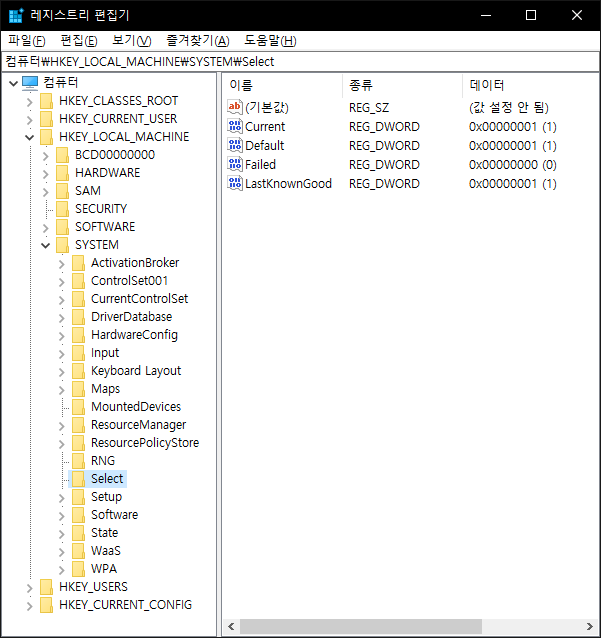
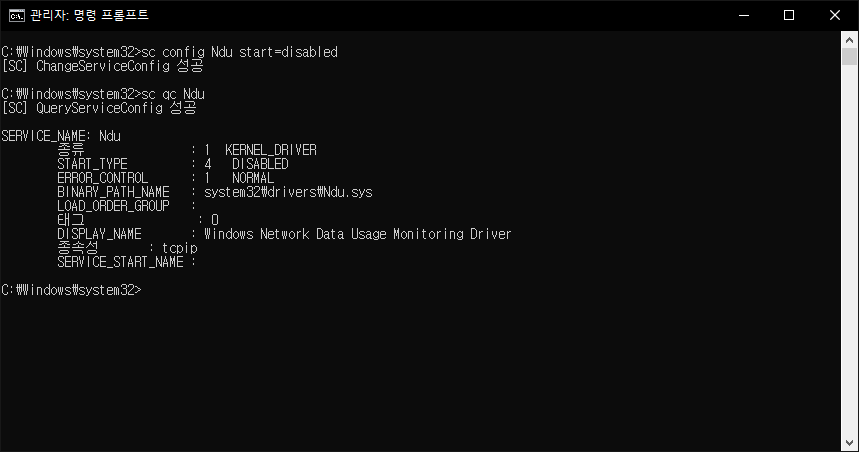

# 서론
예전에 트위터에 [이런 글](https://twitter.com/20sec_Delirium/status/1308109533051379712?s=20)이 돌았던 때가 있다.

뭔 글인지 궁금해서 들어가보니 흔히 있는 "이게 왜 되지"류의 해결책이었다.
<!-- more -->


댓글을 보아하니 주인장도 정확히 뭐가 어떻게 작용하는지 모른다더라. 물론 이런 해결책에 흔히 달리는 "저는 안되는데요"도 있었다. 없으면 섭하지 낄낄...

글의 요지는 메모리 점유율이 심해서 찾아보니 윈10 버그더라, 이케이케 하면 된다더라는 내용이었다. 문제는 이 "이케이케"가 상당히 위험한 접근법이라는 점이다.

## Windows Registry?
[마이크로소프트 공식 문서](https://support.microsoft.com/en-us/help/256986/windows-registry-information-for-advanced-users)에서는 윈도우 레지스트리를 다음과 같이 설명하고 있다.

```
The Microsoft Computer Dictionary, Fifth Edition, defines the registry as:
A central hierarchical database used in Microsoft Windows 98, Windows CE, Windows NT, and Windows 2000 used to store information that is necessary to configure the system for one or more users, applications and hardware devices.

The Registry contains information that Windows continually references during operation, such as profiles for each user, the applications installed on the computer and the types of documents that each can create, property sheet settings for folders and application icons, what hardware exists on the system, and the ports that are being used.
```
거칠게 번역해보자면, 윈도우 레지스트리란 윈도우 계열에서 시스템을 설정할 때 필요한 정보들을 저장하는 [계층형 데이터베이스](https://mariadb.com/kb/en/understanding-the-hierarchical-database-model/)라고 한다. 윈도우가 동작 중에 지속적으로 참조하는 여러 정보들을 담고 있다는 것이다. 윈도우는 이러한 레지스트리를 수정할 수 있게 레지스트리 편집기를 기본적으로 제공한다. 흔히 말하는 `regedit`이 되시겠다. 위 해결책 게시글이 이용하는 것이 바로 이 레지스트리 편집기다.

## 레지스트리 편집의 위험성
위에서 설명한 것과 같이, 레지스트리는 운영체제가 도는 데 필요한 정보들을 담고있는 데이터베이스이다. 보통의 경우 이렇게 중요한 것이라면 일반 사용자가 건드리지 못하게 하는 것이 좋을텐데, Windows는 이를 관리자 권한이라는 시스템으로 통제하고 있다. 문제는 안전불감증에 걸린 대부분의 사용자들이 [사용자 계정 컨트롤(UAC)](https://docs.microsoft.com/ko-kr/windows/security/identity-protection/user-account-control/user-account-control-overview) 창이 뜰 때마다 묻지도 따지지도 않고 예를 누르며 고침과 망침 사이에서 아슬아슬하게 외줄타기를 하고 있다는 것이다. 레지스트리를 함부로 건드리면 어떻게 되는지 모 블로거/유튜버 분이 실험해놓으신 [글](https://hancho1111.tistory.com/74)과 [영상](https://www.youtube.com/watch?v=oC2w6puXKkQ)을 보면 우리 착한 어른이 친구들은 이 작업이 생각보다 위험하다는 결론을 내릴 수 있을 것이다.

## 그럼 저 해결책 글은 의미없는 글인가요?
관리자 권한을 요하는 작업은 지식 없이 함부로 진행하는 것이 문제지, 자신이 하는 일을 알고 자신의 행동에 책임을 진다는 가정 하에 건드리는 것은 상관없다. 이 글을 쓰게 된 결정적인 이유는 해당 게시글에 이 작업이 정확히 어떤 일을 하는지 설명이 되어있지 않았기 때문이다. 각각의 작업이 의미하는 바와 그 결과를 근거에 따라 기술하는 것이 이 글의 의의이다. 아무것도 모르고 하던 작업이 내 컴퓨터에 어떤 영향을 미치는지 알아보도록 하자.

# 해결책 하나씩 뜯어보기
[해당 글](https://blog.naver.com/konchang/220652354252)에서는 다음과 같은 해결책을 제시하고 있다:
```
1. 레지스트리 편집기를 연다.
2. HKEY_LOCAL_MACHINE 폴더의
3. SYSTEM 폴더의
4. Controlset001 폴더의
5. Services 폴더의
6. Ndu 폴더를 찾아서
7. Start의 값을 4로 고쳐준다.
```
하나를 알아보기도 어려운 용어와 행동이 잔뜩 나열되어있다. 그대로 따라하면야 별 문제는 없겠지만, 우리의 목적은 이 각각이 어떤 것인지를 알아보는 것이다. 레지스트리 편집기의 경우 서론에서 거칠게나마 설명했으니 2번부터 출발해보자.

## HKEY_LOCAL_MACHINE?
`HKEY_LOCAL_MACHINE`은 [미리 정의된 키](https://docs.microsoft.com/en-us/windows/win32/sysinfo/predefined-keys) 중 하나이다. 서론에서 레지스트리는 계층형 데이터베이스의 일종이라고 설명한 바 있다. 계층형 데이터베이스는 일반적으로 트리의 형태를 띄고 있는데, 이는 곧 모든 탐색이 뿌리(root) 노드에서 시작된다는 것을 의미한다. 이때, 이 뿌리 노드로써 기능하는 것이 바로 **미리 정의된 키**이다. 이 중 `HKEY_LOCAL_MACHINE`은 데이터 버스 종류, 시스템 메모리, 설치된 하드웨어 및 소프트웨어 등 각종 시스템 정보를 하위에 두고 있다. 결국 이 키를 사용하는 것은 곧 이러한 시스템 정보에 접근한다는 의미로 해석할 수 있다.

## SYSTEM?
`SYSTEM`은 `HKEY_LOCAL_MACHINE`의 서브키(자식 노드) 중 하나로, 아래에서 설명할 `Control set`을 다수 저장한다. 최신 레퍼런스를 찾고 싶었지만 검색 능력이 부족해서인지 [레거시 문서](https://docs.microsoft.com/en-us/previous-versions/windows/it-pro/windows-server-2003/cc728193(v=ws.10))만을 찾을 수 있었다.

## ControlSet001?
`Control set`은 장치 드라이버 및 서비스 등의 시스템 설정 정보를 담고 있다. `ControlSet001`은 그 중에서도 컴퓨터를 마지막으로 부팅했을 때 **사용했을** `Control set`이다(단언하는 어투가 아닌 이유는 무려 공식 문서에서 이렇게 표현하고 있기 때문이다! 심지어 이 문서는 현재 원본에 접근할 수 없으며 [아카이브](https://web.archive.org/web/20150217152952/http://support.microsoft.com/kb/100010)만 남은 상태다). 따라서 이 키를 사용하는 것은 곧 장치 드라이버 혹은 서비스의 정보에 접근한다는 의미로 해석할 수 있다. 또한 `CurrentControlset`은 `ControlSetXXX` 중 하나를 가리키고 있으며, 이는 `SYSTEM`의 서브키 중 하나인 `Select`의 `Current` 값에 따라 결정된다. 



로컬 머신에서 `regedit`을 열어 확인해본 결과 `Current`값이 1이므로, `CurrentControlSet`은 `ControlSet001`과 같다고 볼 수 있다. 이후부터는 둘을 동등하다고 가정하고 진행한다.

## Services?
`Services` 트리는 시스템의 각 서비스들에 대한 정보를 [저장하고 있다](https://docs.microsoft.com/en-us/windows-hardware/drivers/install/hklm-system-currentcontrolset-services-registry-tree). 특히 현재 시스템에 설치되어있는 드라이버들은 `Services` 하위에 서브키로 저장되어 있다. 따라서 이 키를 사용하는 것은 현재 시스템의 서비스 관련 정보에 접근한다는 의미가 된다. 또한, 여기 저장되어있는 서브키들, 즉 서비스/드라이버는 서비스 [마이크로소프트 관리 콘솔(MMC)](https://support.microsoft.com/en-us/help/962457/what-is-mmc)을 통해 관리할 수 있다. 문제는 우리가 다음에 살펴볼 `Ndu`를 서비스 MMC에서 눈을 씻고 뒤져봐도 찾을 수가 없다는 것이다.

## Ndu?
`Ndu`는 `Windows Network Data Usage Monitoring Driver`의 서비스명이다. 이름만 들어보면 대강 무슨 일을 하는지 유추할 수 있겠지만, 마이크로소프트에서 정식으로 이 서비스가 무슨 일을 하는지 문서화해놓은 자료를 찾을 수가 없었다. 또한 서비스 MMC에서도, `Windows PowerShell`에서 `Get-Service *`를 입력해봐도, `cmd`에서 `sc query` 명령어를 때려봐도 아무런 정보를 찾을 수 없었다. 이상한 건 `Get-Service Ndu`나 `sc query Ndu`와 같이 서비스명을 특정하면 검색 결과가 잡힌다는 것이다. 아주 미쳐돌아가시겠다. 공식 문서를 찾을 수 없으니, 이미 알려져 있는대로 **네트워크 데이터 사용량 모니터링**을 하는 서비스라고 생각하고 넘어갈 수밖에. 참으로 찝찝한 결론이 아닐 수 없다.

## Start의 값을 4로?
Start가 서비스의 시작 유형 값이라는 정확한 언급 또한 찾을 수 없었다. 설마 무려 마이크로소프트가 이런 부분을 허술하게 해놓았을 리 없다. 당연히 내 검색 능력의 부족이겠지. 따라서 익히 알려진 대로 Start 값을 변경하여 서비스 시작 유형을 설정한다. 거기까지는 이해할 수 있다. 문제는 이 값이 왜 4가 되어야 하냐는 것이다. 이 또한 공식 문서의 설명을 찾을 수는 없었다. 그러나 검색을 하던 도중, 서비스 시작 유형은 매크로 상수이며, `winnt.h`에 선언되어있다는 사실을 찾을 수 있었다. 원래는 `Windows Kits` 내부에 포함된 `winnt.h`에 선언되어 있는 상수의 이미지를 첨부하려 했으나, 사유 소프트웨어의 라이센스 침해 행위로 판단하여 대신 `GNU LGPL` 라이센스로 공개된 `mingw`의 `winnt.h` 파일에 대한 [링크](https://github.com/Alexpux/mingw-w64/blob/master/mingw-w64-tools/widl/include/winnt.h)를 거는 것으로 대신하였다. 5035~5039번 째 줄을 확인하면 `SERVICE_DISABLED`의 값이 4임을 알 수 있는데, 이러한 매크로 상수 덕분에 Start의 값을 4로 변경하면 해당 서비스의 시작 유형이 **사용 안 함**으로 설정됨을 유추할 수 있다. 물론 이 또한 공식 문서는 찾을 수 없었다. 밥먹고 양치 안 한 기분이다.

## 정리
지금까지 우리는 마법같은 한 줄의 작업을 하나씩 살펴보며 각각이 어떠한 의미를 지니고 있는지 파악해보았다. 한 줄로 요약하자면 다음과 같다:
```
특정 서비스의 시작 유형을 "사용 안 함"으로 변경하기 위해서 레지스트리를 수정하는 작업
```
이러한 속사정을 알게 되었다면, 레지스트리를 편집하는 위험한 작업보다 비교적 안전한 방법을 찾아보는 것이 그 다음 일이다. 레지스트리 직접 수정의 위험성은 서론에서 충분히 설명했으니 말이다.

## 서비스 MMC
원래대로라면 서비스 MMC에 등록된 서비스의 **속성** 메뉴에 들어가 시작 유형을 변경하는 것이 일반적이다. 하지만 위에서 살펴봤듯이, `Ndu`는 서비스 MMC에서 찾을 수 없다.

## Set-Service
`Windows PowerShell`이라는, Windows CUI 중 비교적 현대적인 환경을 이용하여 설정하는 방법이다.


## sc
우리의 영원한 친구 `cmd`를 사용할 때 쓸 수 있는 방법이다(사실 `PowerShell`을 사용할 때도 쓸 수 있지만, 이때는 `sc.exe`와 같이 써야한다).



이상의 해결책은 모두 관리자 권한을 요구한다.

# 결론

## Q. 어차피 다 관리자 권한으로 하는 거 아닌가요?
특정한 작업만을 수행하는 명령어와 건드릴 이유가 없는 데이터에도 접근이 가능한 레지스트리 편집기. 어느 쪽이 더 실수했을 때 위험할 지 생각해보자. 물론 기존의 해결책은 해당 글에서만 제시하는 방법이 아니다. `Ndu` 기능을 끄는 방법을 검색했을 때 대다수의 글들이 레지스트리 편집기를 사용하는 방법을 소개하고 있다. 하라는 그대로만 따라하면 원하는 작업을 수행할 수 있다. 다만 이 글을 쓰는 이유는 레지스트리 편집만이 유일한 해결책이 아니며, 개인적으로 판단했을 때 새롭게 소개하는 방법이 조금 더 안전하다고 생각하기 때문이다.

## 후기
마이크로소프트 공식 웹사이트 이외의 곳을 최대한 배제하고, 근거 자료를 공식 문서로 한정하려니 상당히 부족함을 느낄 수 있었다. 물론 타 웹사이트/블로그의 글 또한 충분히 좋은 자료들이 많고 그들을 폄하할 생각은 아니지만, 기왕에 쓸 거라면 최대한 1차 출처가 될 수 있는 공식 문서에 기대어 글을 쓰고 싶었다. 미진한 부분이 많을테지만 더 이상 질질 끌다간 죽도 밥도 안 될 것 같아 이 정도에서 끝을 내야겠다. 다음번에는 좀 더 검색 능력을 키워 의미있는 결과를 낼 수 있으면 좋을 것 같다.