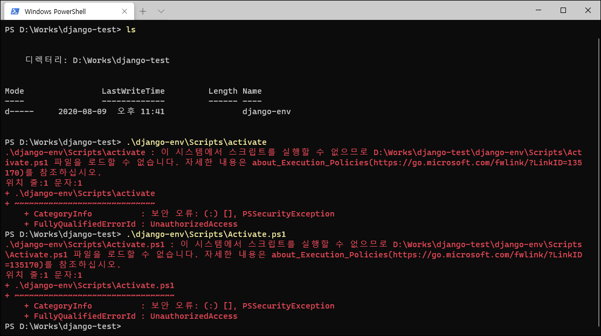
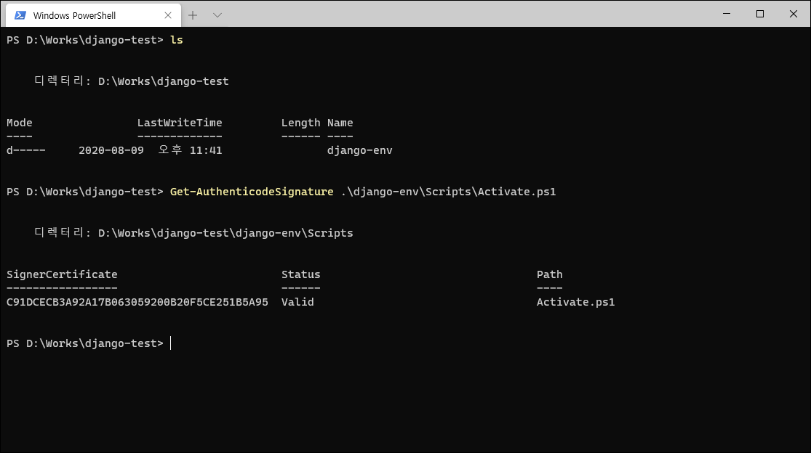
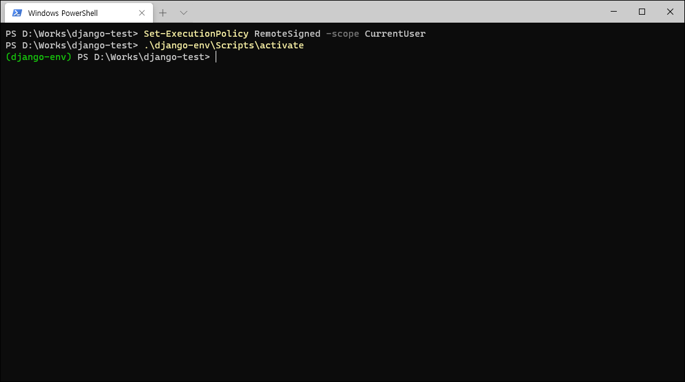

## 서두
CLI, 명령 줄 인터페이스는 일반적으로 GUI, 그래픽 사용자 인터페이스보다 사용하기 어렵다고 여겨진다. 애초에 해커(전통적인 의미)들의 전용 장난감로 인식되던 컴퓨터가 GUI를 만나면서 대중적으로 쓸모를 얻게 되었다는 사실은 모두가 인정할 것이다. 하지만 2020년 현재에도 CLI가 완전히 사라지지는 않았다. 아니, 오히려 어떤 프로그램들은 CLI 환경을 우선적으로 지원할 정도다. 문제는 이러한 프로그램들은 대부분의 경우, 유닉스 계열의 CLI에 최적화되어있다는 점이다. **사실상 표준**인 `bash`를 중심 환경으로 지원하다 보니, 다른 환경에는 상대적으로 신경을 쓰지 못하는 모양이다.
<!-- more -->
## 개요
며칠 전부터 `Django`에 관심이 생겨서 `Python`을 열심히 설치하고 [튜토리얼](https://docs.djangoproject.com/en/3.1/topics/install/#installing-an-official-release-with-pip)을 봤더랜다. 그런데 평소에는 신경쓰지 않던 것이 눈에 들어오더라. `venv`가 그 주인공이다. `Python 3.3` 이상에서부터 새로 추가된 기능인데, 이전의 [virtualenv](https://virtualenv.pypa.io/en/latest/) 의 기능 몇 가지를 표준으로 끌고 들어간 녀석이다. 간단히 설명하자면 이름 그대로 가상환경을 만들어주는 툴인데,  `pip` 등으로 끌어온 패키지들을 전역 환경에는 설치하고 싶지 않을 때라던가, 하위 호환성을 위해서라던가... 그런 경우에 사용한다고 알려져있다. 아무튼 얘가 문제가 되는 게 뭐냐면, 바로 `Windows PowerShell`에서 사용할 때다.



아무런 마음의 준비 없이 윈도우에서 *가상환경*을 쓰려고 하면 이런 시뻘건 오류를 보고 앗뜨거하며 화들짝 놀라 멀티부팅으로 준비해놓은 리눅스로 도망가게 되는 법이다(요즘에는 `WSL`이 나와서 그나마 덜하다). 그리고 이 문제는 `Django` 튜토리얼에서도, 심지어 `Python` 공식 문서에서도 설명해주지 않는다! 이 얼마나 불친절한 경우인가! 나는 예전에도 가상환경을 찍먹해보려다 이 오류에 부딪혀서 한동안 `Python`의 P자만 봐도 경기를 일으키며 뇌가 4분의 2박자로 트위스트를 추던 때가 있었다. 그렇게 쓰고 싶은 기능을 쓰지 못 하던 내 묵은 체증을 뚫어준 것은 `Python`과는 전혀 상관없는 [프로그램의 설치 방법](https://scoop.sh/)이었다.

## Execution Policy?
```
Set-ExecutionPolicy RemoteSigned -scope CurrentUser
```
무슨 일을 하는 명령인지도 모르고 실행하기에는 내 탐구심이 이를 용납치 않는다. 특히 마이크로소프트는 자기네 물건에 대한 문서가 충실하기로 유명한 친구들이다. [공식 문서](https://docs.microsoft.com/en-us/powershell/module/microsoft.powershell.core/about/about_execution_policies?view=powershell-7)의 **Long Description** 절을 번역하며 저 명령이 뭘 의미하는지 알아보도록 하자.

```
PowerShell의 실행 정책은 PowerShell이 설정 파일을 불러오고 스크립트들을 실행하는 조건들을 제어하는 안전 장치이다. 이 기능은 악의적인 스크립트의 실행을 방지하도록 도와준다.

Windows 컴퓨터에서는 로컬 머신, 현재 사용자, 또는 특정 세션에 대한 실행 정책을 정할 수 있다. 여러 컴퓨터들과 사용자들을 위한 실행 정책들을 설정하는 "단체 정책"도 정할 수 있다.

로컬 컴퓨터와 현재 사용자에 대한 실행 정책은 레지스트리에 저장된다. PowerShell 프로필에 실행 정책을 정해놓을 필요는 없다. 특정 세션에 대한 실행 정책은 메모리에만 저장되며, 이는 세션이 종료되었을 때 사라진다.

실행 정책은 사용자의 활동을 제한하는 보안 시스템이 아니다. 예를 들어, 사용자는 스크립트를 실행할 수 없을 때 스크립트 내용을 커맨드라인에 직접 입력하는 것으로 정책을 우회할 수 있다. 대신, 실행 정책은 사용자가 기본 규칙을 정하고 이를 본의아니게 위반하는 것을 방지하게 도와준다.

비윈도우 컴퓨터에서의 기본 실행 정책은 "제한없음"이며 바뀔 수 없다. Set-ExecutionPolicy 명령어는 사용 가능하지만, PowerShell은 해당 명령어를 지원하지 않는다는 콘솔 메시지를 띄운다. 비윈도우 플랫폼에서 Get-ExecutionPolicy 명령어는 "제한없음"을 반환하지만, 해당 플랫폼들은 Windows Security Zones을 구현하지 않기 때문에 동작은 사실상 "우회"와 일치한다.
```
또한 해당 문서의 **PowerShell execution policies** 절을 살펴보면 다음과 같은 내용이 있다.

- Default
    - 기본 실행 정책을 설정한다.
    - Windows 클라이언트들은 Restricted.
    - Windows 서버들은 RemoteSigned.
- RemoteSigned
    - 스크립트를 실행할 수 있다.
    - 이메일과 인스턴트 메시징 프로그램을 포함한 인터넷에서 다운로드받은, 스크립트나 설정 파일들에 대해 신뢰할 수 있는 발행자의 서명이 필요하다.
- Restricted
    - 개별 명령어는 허용하나, 스크립트는 허용하지 않는다.
    - 서식과 설정, 모듈 스크립트, PowerShell 프로필들을 포함한 모든 스크립트 파일들의 실행을 방지한다.
- Unrestricted
    - 서명이 없는 스크립트도 실행할 수 있다. 악의적인 스크립트 실행의 위험이 있다.

한 줄로 요약하자면 사용자가 뭔지도 모를 스크립트를 아무 생각 없이 실행하는 걸 방지하기 위해서 있는 기능인 것 같다. 하지만 우리는 우리가 뭘 하고 있는지 잘 알고 있다! 따라서 기본 실행 정책인 Restricted를 바꿀 필요성이 있다. 그리고 이는 [Set-ExecutionPolicy](https://docs.microsoft.com/en-us/powershell/module/microsoft.powershell.security/set-executionpolicy?view=powershell-7)라는 명령어를 사용하여 달성 가능하다. 해당 레퍼런스의 Parameters 항목을 이용해 맨 위에서 보았던 명령줄을 해석해보자.
```
Set-ExecutionPolicy: 실행 정책 설정 명령어.

RemoteSigned: 인터넷에서 다운로드받은 모든 설정 파일과 스크립트들은 신뢰할 수 있는 발행자에 의해 서명되어있어야 한다.

-scope CurrentUser: 현재 사용자에게만 영향이 미치게 한다.
```
결국 해당 설치 튜토리얼이 의미하는 바는, 실행 정책을 바꿔줌으로써 닷넷 웹클라이언트를 동해 받아온 `Scoop` 설치 스크립트를 `Invoke-Expression` 명령어로 실행할 수 있게 된다는 말이다. 인터넷에서 다운로드된 **올바른 서명을 지닌** 스크립트를 실행할 수 있게 된 것이다. 이는 `Unrestricted`보다 안전하게 컴퓨터를 사용할 수 있는 방법이다. 여기서 우리가 제일 처음 하려고 했던 일로 돌아가보자.

## 해결
에러를 뿜은 스크린샷을 보면 `activate` 배치 파일과 `Activate.ps1`라는 `PowerShell` 스크립트를 실행한 결과를 보여준다. 배치 파일의 경우 에러 내역을 잘 살펴보면 결국 `Activate.ps1`을 실행하려다 뻑난 것을 알 수 있다. 따라서 `Activate.ps1`이 올바른 서명을 지녔는지만 확인해보면 된다. 검색을 통해 특정 스크립트가 올바르게 서명되었는지를 알려주는 명령어인 [Get-AuthenticodeSignature](https://docs.microsoft.com/en-us/powershell/module/microsoft.powershell.security/get-authenticodesignature?view=powershell-7)를 찾을 수 있었다.



올바르게 서명되었다는 것을 확인했으니, 실행 정책을 바꿔주면 해당 스크립트를 실행할 수 있을 것이다.



## 결론을 내자면...
1. 일반 데스크탑 버전의 `Windows` 사용시, `PowerShell`에서는 실행 정책의 존재 때문에 기본적으로 인터넷에서 다운로드받은 스크립트를 사용할 수 없다.
2. `Set-ExecutionPolicy` 명령어를 통해 실행 정책을 변경하여 스크립트를 사용 가능하게 할 수 있다.
3. `Get-AuthenticodeSignature` 명령어를 통해 특정 스크립트가 신뢰할 수 있는 발행자에 의해 서명되었는지 확인할 수 있다.

## 후기
이 글을 쓰려고 준비하면서 제일 처음 들었던 생각은, `Windows`에서 명령줄 작업을 하기에는 너무 열악하다는 생각이 들었다. `WSL`이 있다고는 하지만, 그건 어디까지나 리눅스 레이어에 의존하는 것이며 `Windows` CLI 중 가장 현대적인 `PowerShell`에 대한 지원이 상당히 부족하다는 느낌을 지울 수가 없었다. `Windows`를 개발 OS로 사용하는 것은 `Windows` 네이티브 프로그램을 개발하는 것이 아니라면 적극 피하고 싶어지는 경험이었다.

또한 찾아보니까 [이전에 같은 주제를 한국어로 작성한 블로그](https://ssaemo.tistory.com/248)가 있었다. 글을 작성하며 검색하다가 찾게 되었는데, 역시 `내게 닥친 문제는 세상의 누군가가 한 번은 미리 겪었던 문제다`라는 말이 틀린 말이 아니라는 생각이 들었다. 왜 그때는 이 포스트를 찾을 수 없었을까. 그리 복잡한 문제는 아니었지만, 해결을 위한 접근 방법의 차이가 있으니 이쪽도 한 번 들러보시고 차이점을 알아가실 수 있으면 좋겠다.