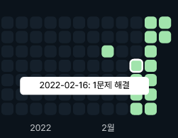

# 서론
1월이 알찼으니 2월은 좀 느긋해도 되지 않을까? 라고 지나와서 생각해보니 너무 쓸데없는 데 시간을 많이 보냈다. 사실 글을 뭐라고 쓰고있는 건지도 잘 모르겠다. 파우스트를 너무 빨리 마셔서 그런가 뇌가 잘 돌아가지 않는다. 그래도 할 일은 해야지. 2월 한 달간 있었던 일들 중 쓸모있는 것들을 모아 기록해보자.
<!-- more -->
## 코딩 테스트 준비
코드업 C언어 기초 100제를 다 풀었다. 개인적으로 문제를 풀 때 첫 접근으로는 range-based for loop를 쓰려고 많이 생각하는 편인데, 그러기엔 인덱스를 써야 쉽게 풀리는 문제들이 많은 것 같다. C++11이 등장하기 전에 생겨난 문제들이 많아서 그런가 싶기도 하고, 두 개 이상의 시퀀스에 대해 같은 인덱스를 공유하는 문제나 임의의 크기만큼 증감해야하는 인덱스를 써야되는 문제 등 일반적인 전체 순회로는 깔끔하게 해결되지 않는 것들이 많은 것 같다.

코드업 100제를 완료한 이후, 그리디 50문제 풀기에 도전하고 있다. 한 학기만큼의 여유가 아직 있긴 하니까, 하루에 한 문제씩 차근차근 쌓아가기로 했다. 처음 시작했을 땐 애걔 싶었는데 어느새 13일이나 계속되고 있다. 풀다 힘들면 탐색 50문제 풀기로 도망칠 거고, 다 끝나면 기초 DP 50문제 풀기도 진행할 거다. 그렇게 한걸음씩 나아가면 적어도 코딩 테스트에 발목잡힐 일은 없겠다.

## 전공종합설계
팀 자체는 1월달쯤에도 대강 어떻게 할 지 결정되어있긴 했었다. 친한 후배가 살려달라고 읍소를 하는 바람에 팀에 들어가게 되었다만, 난 아직도 내가 왜 그 정도의 대우를 받는건지 알 수가 없다. 아마도 모바일 애플리케이션을 만들게 될텐데, 최대한 팀원 간 얼굴 붉히는 일 없이, 잘 풀려서 한 학기의 팀플을 잘 마무리했으면 좋겠다. 그리고 좀 더 나아가서, 별도의 회고글을 쓸 수 있을 정도로 결과물이 나와주길.

## 수강신청
후배님 대신 잡아준 교양을 제외하면 총 13학점의 강의를 듣게 된다. 전공학점이 모자라긴 하지만, 그건 2학기 때 현장실습을 나가서 채워볼 생각이다. 비교적 적은 학점의 강의를 들으려한 이유는 크게 두 가지가 있다.

1. 정보처리기사 자격증 준비
2. 최소 토익 700점 이상, 목표 900점 이상

정처기야 뭐 원래 따야되는 것이기도 하고 내용을 보니 그리 오랜 시간이 걸릴 것 같지는 않지만, 토익은 약간 이야기가 다르다. 하고싶어서 하는 건 아니고, 일정 이상 점수를 획득하면 비교과 장학금을 준다고 해서 도전해보려고 한다. 단어 공부 좀 제대로 하고, 문법에서 헷갈릴 만한 요소들을 줄이면 700까지는 문제없을 거 같긴 하다. 이럴 때 아니고 언제 영어 공부를 각잡고 해보겠어.

## 정리
정리해놓고 보니 뭣도 아닌 것 같다. 해야할 사이드 프로젝트도 있고, 공부해야 할 다른 분야도 있지만 잠도 열심히 자고 게임도 열심히 했다. 쉬는 건 좋지만, 쉬는 것에 빠져버리면 안 되는데. 신학기를 시작하면 신년때만큼의 의욕이 날 수 있을까. 물론 의욕이 없어서 못한다는 말은 이제는 핑계라는 걸 나도 잘 안다. 그냥, 그냥 하는 거다. 아침에 일어나 나가기 위해 샤워를 하는 것마냥 말이다.