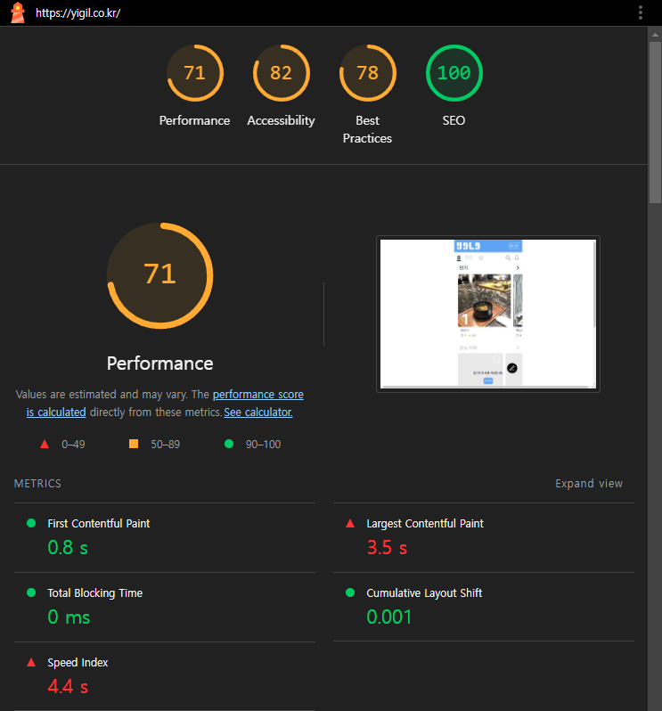

프로젝트가 끝나고 2주 가까이 풀스트레이트로 놀며 느낀 점은 휴식이란 고된 노동에 따라와야 그 달콤함이 배가되는 것 같다는 것이다. 시간 가는 줄도 모르고 놀아제끼고 있었으니ㅋㅋ 사실 냉정히 따져보자면 그럴 여유가 없긴 하다. 무슨 회사 퇴사한 것도 아니고... 하지만 뭐, 정신건강도 중요한 요소 중 하나라고 생각하니까. 그 부분에 있어서는 확실히 회복이 된 것 같다. 이제 슬슬 뭔가 생산적인 일을 해야겠다는 생각이 들기 시작했으니 말이다. 지난 12월 말부터 3월 말까지 거진 3개월의 기간 동안 작업했던 프로젝트를 잠깐 소개하고, 작업하며 느꼈던 점들을 짚은 다음 앞으로 해야 할 일을 고찰해볼 예정이다.

<!-- more -->

# 프로젝트 소개

프로젝트 이름은 [이길로그](https://github.com/Kernel360/f1-Yigil)로, 간단히 설명하자면 "지도 기반 장소 기록・공유 서비스"이다. 네이버 장소검색 API를 이용해 원하는 장소를 검색한 후 지도에서 해당 장소의 위치를 확인할 수 있으며, 장소에 대한 사진과 평가를 곁들여 게시글을 올리고 사람들은 해당 게시글에 좋아요 또는 댓글 작성 등을 할 수 있도록 하였다. 한국 내의 장소가 메인 이야깃거리가 될 수 있는 일종의 SNS를 만드는 것을 목표로 하였다.

## 총평

개인적으로 점수를 매기자면 100점 만점에 50점 정도를 주고 싶다. 직접 만든 것치고는 꽤나 평가가 박한 것으로 보일 수도 있지만, 내 주관적인 기준에서는 이 정도면 엄청 잘 쳐준 것이라고 생각한다. 시간 관계상 처음에 의도했던 기능을 다 반영하지 못한 것은 내부 사정이니 그렇다 해도, 우선 속도가 매우 느리다는 느낌을 강하게 받았다. 밤새가며 만들 때는 이미지의 비중이 매우 큰 사이트니까 어쩔 수 없다고 어찌저찌 자신을 속였지만, 시간이 지나고 다시 보니 사용자 경험에 굉장히 부정적일 것 같다.

## 성능 이슈

무엇이 문제일지 홈 페이지의 Lighthouse 지표를 통해 알아보자.

LCP와 Speed Index 부분에서 좋지 않은 결과를 보이고 있다. 주된 원인은 LCP 요소인 이미지에 대한 TTFB와 로드 시간이 큰 것으로 확인되었다.

LCP 요소이다보니 화면을 열 때 바로 보여야 한다고 생각해서 `priority={true}`를 줬던 게 문제일까? 항상 최신 상태여야 한다는 생각에 최상단에 주었던 `export const dynamic = 'force-dynamic';`이 문제일까? 백엔드는 잘 해주셨을 거라고 믿고 있어서 프론트엔드에서 할 수 있는 모든 것을 다 해본 후에나 이야기를 꺼낼 수 있지 않을까? Next.js에 익숙하지 않은 상태로 다이빙해서 명확한 답을 얻기가 힘든 것 같다. 사실 홈 페이지 외에도 느린 부분이 많아서 내가 Next.js에 익숙하지 않은 것이 원인이라는 생각이 제일 크게 든다. 많이 배우긴 했지만 아직도 배울 점이 많은 것 같다...

## Context API, Reducer

이번 프로젝트에서는 서드 파티 상태 관리 라이브러리를 사용하지 않았다. 처음에 도입을 할까말까했는데, 결과적으로는 해당 라이브러리들이 왜 등장하게 되었는지에 대한 이유를 느낄 수 있어 매우 뜻깊었다고 생각한다. 가장 생각나는 예로는 에러 메시지를 보여주는 토스트를 렌더링할 때를 들 수 있겠다. 에러 토스트는 모든 상황에서 동일한 위치에 뜨고, 동일한 쓰임새를 가지기 때문에 최상위에 위치시키는 게 좋겠다고 생각했는데 만약 그럴 경우 에러 토스트를 보여주기 위해 리렌더링할 때마다 하위 모든 컴포넌트가 불필요하게 리렌더링될 것이라는 예상 때문에 함부로 에러 토스트의 위치를 끌어올릴 수 없었다. 또한 사용자에게서 데이터를 입력받는 화면에서 보여줄 UI 요소가 많아서 상위에 Context를 두고 해당 컴포넌트들을 감싸는 방식으로 구현했는데, 때문에 실제로 불필요한 리렌더링이 계속 발생하는 것을 확인할 수 있었다. 공부 목적이 컸다고는 하지만 심히 마음이 불편했고, 다음 번에는 꼭 이런 문제를 해결해주는 도구를 사용해야겠다는 생각이 들었다.

그래도 Reducer 함수를 이용해 상태 갱신 코드를 밖으로 빼내는 경험은 매우 재밌었다. 특히 상태를 끌어올리고 다른 컴포넌트에 전달해주며 그에 따른 타입 지정 코드를 일일이 작성하는 것이나 그렇게 작성된 코드를 보며 컴포넌트 트리를 거슬러 올라가는 씐나는 경험을 해본 후, 상태 갱신 로직과 UI 표현 코드의 분리를 맛보게 되니 그만큼 심신이 안정되는 경험이 또 없었다. 막바지부터 지켜지지는 못했지만 단위 테스트를 통해 해당 Reducer를 테스트하는 것만으로도 UI 로직을 검증할 수 있었던 것도 기억에 강하게 남아있다. Flux 패턴의 참맛을 알게 되었달까.

## 정리

이번 프로젝트에 참여하게 된 주요 이유는 다음의 두 가지이다.

1. 2023년 후반 ~ 2024년 초반 현재 프론트엔드 JD에 가장 많이 등장할 기술 스택 중 하나인 Next.js를 사용한 프로젝트 진행
2. 일정 기간 이상의 협업 경험

서류 합격을 뚫지 못하던 나에게 부족한 것이 무엇일지 내 자신이 판단해보았을 때, 위의 두 가지가 가장 크다고 생각하여 이길로그 팀에 들어가게 되었다. 해당 목표를 이루게 되어 의미있었고, 코드를 작성하며 느끼게 된 점도 많아 더욱 좋았다. 팀원들과의 큰 불화 없이 프로젝트가 진행되었다는 점도 끼워넣을까 했는데, 안 싸우고 어떻게 좋은 프로덕트가 나오냐는 말도 들려오는 것을 보면 이 점은 꼭 좋은 것만은 아니었다는 생각도 든다. 난 항상 다른 사람들의 부족한 점을 보기 전에 내 자신의 단점들이 먼저 보여서 별 생각이 안 나는 사람인데, 이걸 어떻게... 고쳐야 하는 건가 싶기도 하고.

이러나저러나, 돌이켜보면 아쉬운 점은 많지만 참여한 것 자체는 정말 후회없는 프로젝트였다고 할 수 있겠다.

# 앞으로 해야 할 것

뭐 별다를 것 없다. 이력서를 수정하고, 구직 활동과 공부를 계속하는 것이 되겠지. 세상에 공부해야할 것은 천지고, 내가 흥미있는 것도 수없이 많으니까. 팀 프로젝트를 한다는 변명 하에 멈춰두었던 개인 프로젝트도 다시 잡아야 하고, 멈춰두었던 강의도 계속 들어야 한다.

## 끝으로

벌써 4월의 절반이 지나버렸다. 뭐 했다고 시간이 이리 가는건지. 글을 반듯하게 마무리짓고 싶은데 많이 늦었다는 생각을 하니 모난 마음이 드는 것 같다. 남은 반 달(ㅋㅋ)은 더 의미있게 보낼 수 있게 노력해야 해!!!
