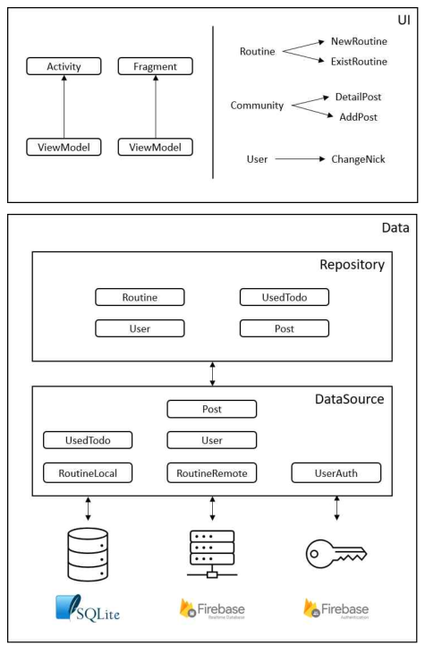

4학년 1학기의 사실상 전부를 쏟아넣었던 전공종합설계 과목이 끝났다. 항상 화난 표정이었던 내 책상 위의 문어도 이젠 웃음을 되찾았다[^1]. 관련해서 자료도 만들어 발표를 끝냈으니 마지막으로 작업물을 정리하며 회고글을 써보려 한다. 발표 자료를 만들 때는 기술적인 내용을 중점적으로 해서 4개의 프레젠테이션 파일을 만들었다. 회고글에서는 해당 부분들을 간단하게 다루고, 그 외에 발표 때는 말하지 못했던 투정이나 아쉬웠던 점을 정리할 것이다.
<!-- more -->

이번에 만들었던 프로그램은 ‘사용자가 할 일 목록 템플릿(이하 루틴[^2])’을 만들고 업로드하여 공유할 수 있고, 다른 사용자가 만든 루틴을 자유롭게 다운로드 및 수정하여 자신만의 루틴을 만들 수 있는 ‘루틴 관리 모바일 애플리케이션 및 공유 커뮤니티 서비스’이다. 루틴 관리라고 해봐야 기존에 있는 투두리스트와 크게 다를 바가 없지 않나하는 생각이 들 수도 있다(개인적인 생각으로는 바로 그 이유 때문에 학점이 B0가 나온 것 아닌가싶다). 하지만 자기변명을 조금 해보자면, 그래도 기존 서비스에 없는, 이 서비스만의 차별점을 따로 기획하여 구현에 성공했으니 이미 있는 서비스를 베낀 건 아니지 않을까… 솔직히 학점을 잘 받았으면 모르겠는데 저 모양이니까 자신감이 좀 떨어진다.

차별점으로는 크게 두 가지를 들 수 있다:
1. 제삼자의 루틴을 다운로드받아 사용자의 로컬 기기에서 바로 적용하여 사용할 수 있다. 물론 마음대로 수정할 수도 있다.
2. 각 할 일에 대해 중요도를 입력할 수 있다. 이에 따라 어떤 할 일이 더 중요한 지 시각화할 수 있으며, 최우선으로 해야 할 일을 사용자에게 제시할 수 있다.

## 전체적인 프로젝트 구조
클린 아키텍처에 기반한, 안드로이드 개발자 문서에서 권장하는 [권장 앱 아키텍처](https://developer.android.com/topic/architecture?hl=ko#recommended-app-arch)를 적용하였다. 또, Android Architecture Component(이하 AAC) ViewModel과 LiveData를 사용하여 화면에 표시될 데이터를 관리하는 코드를 작성하였다. 마지막으로, 의존성 주입 프레임워크 [Dagger](https://dagger.dev/)/[Hilt](https://dagger.dev/hilt/)를 사용하였다. 전체적인 도식은 다음과 같다:

## 권장 앱 아키텍처 적용
DataSource → Repository → UseCase → UI Layer의 순서로 흘러가는 데이터 흐름을 알고, 각 계층 사이에 인터페이스를 두어 의존관계 역전 원칙(Dependency Inversion Principle, DIP)을 따르도록 구현하였다. 이를 통해 실 구현체의 내부 구현이 변경되더라도 별다른 변경 없이 인터페이스를 통해 해당 모듈을 사용할 수 있어 편리했다…고 말하고 싶지만, 애초에 기획이 날림이어서 그랬는지 인터페이스의 변경이 굉장히 잦았다. 그래도 각각을 수정하기 시작할 때, 생각했던 것만큼 전체적으로 갈아엎는 일은 잘 없었으니 확실히 이득을 보았다고 이야기할 수 있을지도 모르겠다.

클린 아키텍처라는 말을 모르고 있었던 건 아니지만, 언젠가는 주의깊게 살펴볼 필요가 있다고 평소 생각했었는데 이런 식으로 이론적인 공부 없이 적용해보게 될 줄은 몰랐다. 그렇다고 해서 이제 클린 아키텍처의 장점이 느껴지냐고 묻는다면 그건 또 아닌 것 같다. 물론 변경에 강인한 코드를 작성하는 데에는 관심이 있다. 클린 아키텍처를 적용한다면 테스트와 유지보수가 용이해지며 이것이 곧 변경에 강인한 코드 작성의 밑바탕이 된다는 것 또한 알고 있다. 그러나 이는 어디까지나 오래 지속되는 코드에 한하여 적용되는 말이 아닐까? 실제로 오래 돈을 벌고 있는 서비스의 유지보수 업무에 들어가는 경우 정도가 아니고서야 주니어 레벨에서 클린 아키텍처의 장점을 느끼기엔 무리가 있다고 생각한다(그와는 별개로 알아두면 좋긴 하겠지만).

## AAC ViewModel, LiveData, Kotlin Flow
Activity와 Fragment는 화면에 데이터를 렌더링하고 사용자 상호작용을 처리할 책임이 있는 구성요소이다. 여기서 I/O 등의 작업까지 모두 처리를 하게 코드를 작성할 수도 있겠지만, UI 구성요소에 UI 이외의 책임을 지우게 만들고 싶지는 않다. AAC ViewModel을 사용하여 UI 관련 정보를 관리하고 UseCase 객체를 통해 데이터를 획득하게 구현하였다.

도식의 하단부에서 볼 수 있듯이, 실질적인 데이터는 내장 데이터베이스나 외부 네트워크에서 위치한다. 이러한 데이터에 접근하기 위해 단순히 응답이 돌아올 때까지 실행을 멈추는 동기적인 방식을 취한다면 [응답 없음 오류](https://developer.android.com/topic/performance/vitals/anr?hl=ko)가 발생한다. 별도의 스레드에 작업을 할당해놓고, 완료되었을 때의 결과에 따라 응답하는 코드를 작성해주는 멀티스레드-비동기 방식으로 코드를 작성하였다.

일반적으로 데이터 변경이 있을 경우, 개발자가 UI를 업데이트하는 코드를 직접 호출해줘야 하는 방식으로 생각하는 경우가 많다. [관찰자 패턴](https://johngrib.github.io/wiki/pattern/observer/)을 따르는 [LiveData](https://developer.android.com/topic/libraries/architecture/livedata?hl=ko)를 이용하면 직접 업데이트 코드를 호출할 필요 없이 데이터가 변경될 때마다 `Observer`가 UI를 업데이트해준다.

DataSource에서 획득한 데이터는 불변하지 않고 시간이 지남에 따라 다른 값을 가질 수 있다. 일반적으로 함수는 한 번 호출하면 하나의 값만을 반환하고 종료되기 때문에, 가장 최근에 업데이트된 값이라는 보장이 없다. Kotlin의 [Flow](https://kotlinlang.org/docs/flow.html)는 생산자-중개자-소비자 모형에 따라, 데이터를 사용하고 싶은 곳에서 수집 명령을 내리면 값이 순차적으로 생성되고 수정되어 전달받아 사용할 수 있다. Flow를 사용하여 DataSource에서 일어나는 데이터의 변경이 감지될 때마다 전달하면 항상 데이터를 최신으로 유지할 수 있다.

흔히 말하는 [반응형 프로그래밍(또는 리액티브 프로그래밍)](https://juneyr.dev/reactive-programming)을 적용해보았다. 3학년 때 대체 어떻게 이거 없이 모바일 앱을 만드는 프로젝트를 했었는지 기억이 안 날 정도로 자연스럽게 다가온 개념이었다. 리액트를 좀 만지다가 해서 그랬나? 너무 괴리감없이 적응해서, 앞으로는 최대한 이런 방향으로 작업하고 싶다는 생각이 계속 들었을 정도였다.

## Dagger/Hilt를 이용한 의존성 주입
도식의 데이터 계층에서 확인할 수 있는 요소들 각각을 인터페이스에 의존하도록 하고, 의존성을 생성자에 명시적으로 드러내었다. 이렇게 하니 각 요소가 실제 구현체에 의존하지 않게 되어, Fake 객체 등의 테스트 더블을 이용해 단위 테스트 코드를 작성하기 용이하였다. 의존성 관리는 Dagger와 Hilt라는 프레임워크/라이브러리를 이용하였는데, 의존성 주입에 따르는 객체 생성 등의 상용구 코드를 줄일 수 있어 코드의 양을 비교적 적게 가져갈 수 있었고, 하위 의존성을 추가적으로 생각하지 않아도 되어서 편했다.

이전에는 IoC가 뭔지, DI는 또 뭐고 서비스 로케이터는 또 뭐고… 하여간 제대로 정리가 되지 않아서 머리가 복잡했는데 이번 경험을 통해 제어의 역전이란 어떤 것인지, 그리고 이를 구현하기 위한 프레임워크들(Dagger, Koin 등)을 고민해보며 의존성 주입이나 서비스 로케이터 패턴 등에 대한 이해를 높일 수 있었다.

## 아쉬웠던 점

### NoSQL에 대한 이해 부재
Firebase 실시간 데이터베이스(이하 실시간 DB)을 쓰는 것에 익숙치 않아, 막판에 발생한 오류를 제대로 잡지 못했던 것이 매우 아쉬웠다.

실시간 DB는 키-값 형태의 NoSQL 데이터베이스이며, [`DatabaseReference`](https://firebase.google.com/docs/reference/kotlin/com/google/firebase/database/DatabaseReference)라는 단위로 데이터에 접근할 수 있다. 변경 이벤트 리스너를 작성하여 특정 `DatabaseReference`의 값이 변경될 때마다 Flow에 새로운 값이 담길 수 있도록 할 수 있는데, 한 번에 여러 개의 `DatabaseReference`를 수정하는 방법을 찾지 못해 루트 노드에 대한 변경 이벤트 리스너를 작성하는 방향으로 가닥을 잡았다. 공부할 때 좋은 방법이 아니라는 서술을 찾을 수는 있었지만, 시간에 쫓기고 있었던지라 찜찜하지만 계속 진행할 수밖에 없었다. 좀 더 똑똑한 방법이 있었을까?

특정 `DatabaseReference`에 자식 값을 생성할 때 부여해준 UUID를 이용해 다른 `DatabaseReference`에도 자식을 생성해주어 같은 UUID로 접근할 수 있도록 했는데, 두 `DatabaseReference`에서 얻어온 값이 동시에 삭제되지 않아 둘 중 하나의 변경 이벤트 리스너에서 계속 `NullPointerException`이 발생하는 문제였다. 당장에 앱이 종료되는 것을 막기 위해 실제 오류가 나는 곳을 고치는 게 아닌, Flow를 단순 함수처럼 값을 한 번만 받아오도록 했지만 이건 오류를 고친 게 아니고 그냥 방치한 거지. 지금 상태로는 출시할 수도 없다.

지금도 저 문제는 어떻게 풀어야할 지 모르겠다. 애초부터 설계가 잘못되었다는 생각도 든다. SQL처럼 on delete cascade를 걸어줄 수 있다면 좋았겠지만 그렇게 못하니까… NoSQL은 처음 쓰는 것이기도 하고, 기존에 생각하던 방식이 너무 SQL스러웠다보니까 생각의 틀을 깨기가 너무 어렵다. 이번 프로젝트에서 유일하게 해결하지 못한 부분이다.

### 팀원에 대한 신뢰도 부재
또 하나, 많이 아쉽지는 않지만 꼽아보자면 딱히 팀 프로젝트스럽지 않았다는 것 정도일까? 팀장을 하기 싫어서 팀원이 되었지만 사실상 작업의 90퍼센트는 내가 했다. 아이디어도 내가 낸 게 채택되었고 내가 작업을 분배해줬으며 그마저도 결과물이 마음에 안 들어서 내가 고쳐썼다. 최종보고서도 나 혼자 다 썼다. 아니, 다 쓸 수밖에 없었다. 타 팀원에 대한 신뢰도가 사실상 없었기 때문이다.

이번에 팀이었던 두 명의 학우는 전공 학업에 그다지 흥미를 느끼지 못하고 4학년을 맞이해버린 상황이었다. 둘 중 한 명과는 전부터 친분이 있었고, 살려달라는(ㅋㅋ) SOS 신호에 못 이겨 팀에 들어갔던 거기 때문에 힘들거란 각오는 하고 있었다. 그런 상황에서 위에 적힌 것들을 다 적용하다보니 프로젝트를 따라오는 것 자체가 그 둘에게는 너무 버거웠을 것이다. 늦게나마 전공을 살려 취업하겠다는 생각이라도 들어 말을 했다면 밤을 새가면서라도 설명을 해줬겠지만, 아예 이 쪽에 더 이상 관심이 없어보이는 사람들에게 그렇게 밀어붙일 수는 없는 노릇이니까…

## 결론
분명 적용한 이론이나 기술은 많았고, 확실히 배운 게 많은 프로젝트였다. 익숙했던 것이 단 하나도 없었는데, 자잘한 오류가 있긴 하지만 일단 돌아는 가는 걸 만들었다는 것 자체가 개인적으로는 좀 놀라웠다. 문제는 들인 노력에 비해 성적이 좀 많이 안 좋았다는 거지. 이 과목은 절대평가이고, 기타 과제물과 최종보고서를 제출하면 B0는 나온다고 교수님이 공언하신 바 있다. 결국 이 프로젝트의 결과는 최하점이라는 말인데… 노력과 결과는 비례하지 않는다지만 좀 많이 씁쓸하다. 하지만 부족한 부분이 있는 건 사실이니, 감내할 수밖에.

못 썼던 6월 회고는 이걸로 대신하려 한다. 사실상 6월 전부를 프로젝트로 보냈으니까… 뭐, 정리도 마쳤으니, 힘들었던 과거는 잊고 잠시 쉬어가야지! 못 했던 게임이나 좀 해야겠다.

### 프로젝트 저장소
프로젝트 작업물과 최종보고서가 있는 저장소는 [이 링크](https://github.com/GNUCS-2022-Capstone-Design-ShareRoutine/ShareRoutine)를 통해 접근할 수 있습니다. 혹시나 상세 구현에 대해 궁금한 점이 있으시다면 해당 저장소를 참고해주시기 바라요!

[^1] [https://toys.teeturtle.com/products/the-original-reversible-octopus-plushie?variant=19577791480953](https://toys.teeturtle.com/products/the-original-reversible-octopus-plushie?variant=19577791480953)

[^2] [https://www.openads.co.kr/content/contentDetail?contsId=8118](https://www.openads.co.kr/content/contentDetail?contsId=8118)