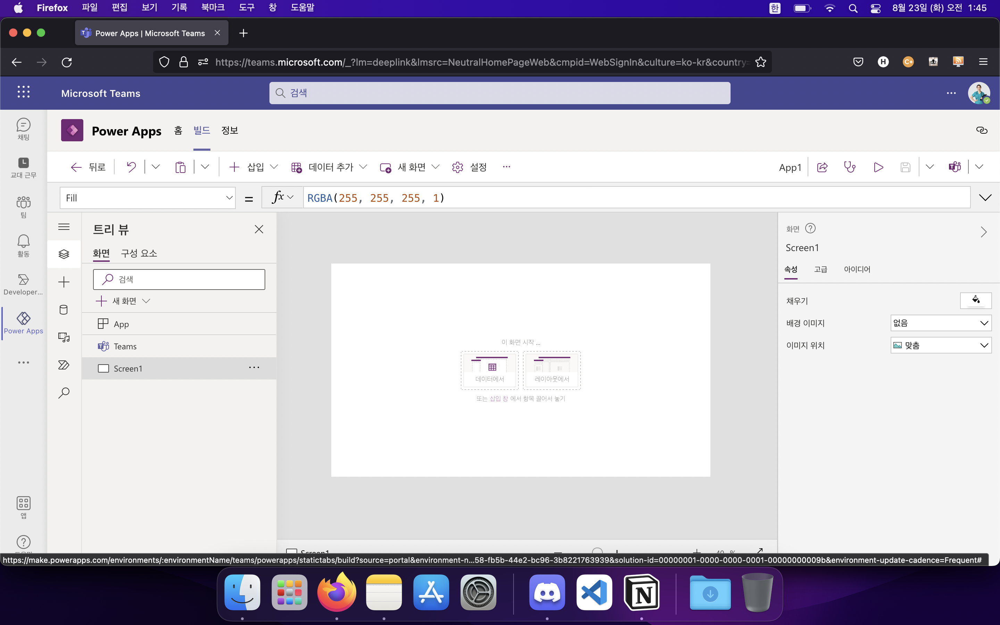
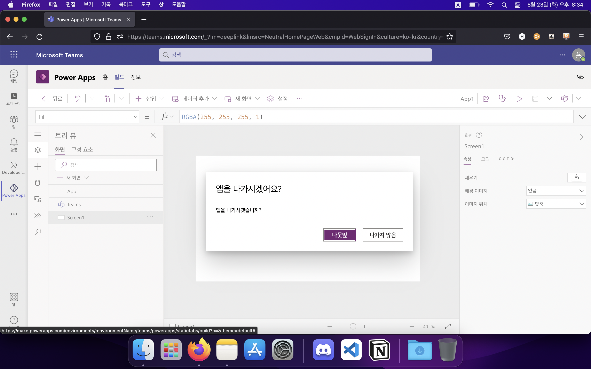
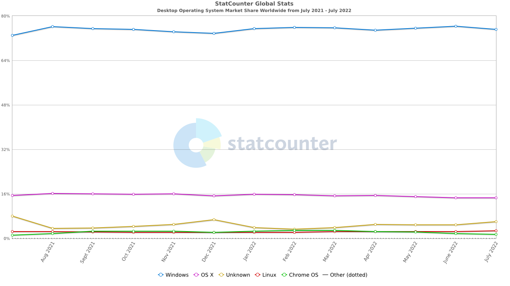

행사가 끝난 당일, 집으로 돌아오며 정말 많은 생각을 했다. 대부분의 경우 이랬으면 어땠을까, 저랬다면 달랐을까 하는 후회와 개인적으로 맘에 안 들던 것들을 방패삼은 자기도피가 주로 떠올랐다. 오해가 있을까봐 미리 말해놓자면, 팀원 분들은 만나서 같이 작업할 수 있어서 정말 너무 엄청, 한 줄짜리 수식어 뭉치로는 부족할 정도로 좋았고 행사 자체는 참여하면서 굉장히 행복했다! 전공에 관심이 있었던 주제에 대체 왜 이전에는 이런 기회들을 먼저 찾아다니며 참가하지 않았나, 지금 와서 생각해보면 난 정말 게으르게 살고 있었다는 자괴감도 살며시 든다.
<!-- more -->

이 글에서 다루고 싶은 것은 참가하면서 느꼈던 내 개인적인 생각뿐이다. Junction이라는 해커톤 자체에 대한 정보가 필요하신 독자분이시라면 다른 글을 찾아보시는 게 좋을 것 같다. 아, 혹여 앞으로 열릴 Junction에도 Microsoft가 주요 파트너로 계속 참가하게 된다면 조금이나마 도움이 될지도 모르겠다.

# 실패라는 판단의 이유
제목을 보면 쉬이 짐작할 수 있겠지만, 상을 타거나 하지는 못했다. 애초에 수상을 목적으로 모인 팀도 아니었고(만약 그랬다면 팀에 들어갈 용기조차 내지 못했을 것이다), 단순히 경험을 쌓고 싶었던 사람들이 함께 했기 때문에 행사가 진행되는 내내 서로를 격려하며 걱정하는 좋은 분위기가 지속되었다고 생각한다. “어라, 그럼 그냥 마음껏 즐기고 온 것 아닌가?”라고 물을 수 있겠다. 객관적으로 보자면 그렇다고 생각한다. 하지만 내 마음이 그렇지 못한 데에는 몇 가지 이유가 있다.

## 내 역량 부족
확실히 말하고 넘어가는 게 좋을 것 같다. 이번 팀 작업의 실패는 사실상 개발 역할군이 작업을 완료하지 못했기 때문이라고 개인적으로는 생각한다. 물론 다른 개발 역할 팀원을 탓하려는 것도 아니다. 나를 제외하면 개발 역할 팀원은 두 분이 더 계셨다. 한 분은 행사 시작이 얼마 남지 않은 날 코로나19 확진 판정을 받으시고 행사 기간 도중 증상에 시달리시느라 온라인으로조차 참여할 여건이 되시 못했다. 다른 한 분은 익숙지 않으신 Microsoft 클라우드 관련 환경 세팅에 애를 먹으셔서 실 개발에 시간을 쏟으실 수 없으셨다. 그럼 너한테는 무슨 일이 있었냐고? 그 부분을 이제부터 이야기해보려 한다.

### 역량 부족 1. 제출 기한 착각 및 중요도 설정 실수
우리 팀은 이틀째 되는 날의 중반쯤이나 되어서야 아이디어의 가닥을 잡고 정리한 상황이었다. 다음 날 12시 30분이 최종 제출 기한이었으니 사실상 만 하루밖에 시간이 남지 않은 셈이었다. 그런데 나는 시간표를 잘못 해석하여 그 이후에도 제출을 할 수 있는 줄로 알고 있었다. 그치만 그렇잖아… 분명히 Final ‘Draft’라면서… draft는 초안 말하는 거 아니었어? 완성작 따로 내야 되는 거 아니야? 거기다 17시 15분 란에 적혀있던 ‘Final Pitch’라는 표현 덕분에 그 때가 완성작 제출 기한인 것으로 해석해버렸다. 하지만 조금만 더 찬찬히 읽어보고 생각해보면 알 수 있었던 일이다. 애초에 18시에 헤어지는데 20 몇 개나 되는 팀의 작품을 45분만에 어떻게 다 보냐? 으휴 멍충아…

중요도 설정 실수 또한 제출 기한 착각 때문에 한 것이다. 실제 제출 기한이 1시간 남았을 때 나는 비로소 내가 잘못 생각하고 있음을 깨달았다. 중요한 기능이 먼저 동작하는 지를 확인하고 나머지 것들을 신경써야 하는 게 맞았는데… 하지만 들어보세요, 솔직히 억울한 마음이 없진 않아요.

### 역량 부족 2. Microsoft Teams 및 Power Platform 이해도 부족
Teams 같은 경우야 Office 깔면 자동으로 같이 깔려서 컴퓨터 시작할 때 구동 화면이 뜨는 걸 보고 시작 프로그램 설정으로 들어가서 끄는 경우가 왕왕 있었기에 그 존재를 모르진 않았지만 Power Apps는 정말 처음 듣는 문물이었다. 아니, Power Apps를 비롯한 Power Platform 제품군 자체를 이번 해커톤을 통해 처음 알게 되었다. 그러니까, 아예 처음 보는 도구를 가지고 작업을 진행해야 됐다는 말이다.

장인은 도구를 탓하지 않는다고 했던가. 나는 그 말에 굉장히 동의하는 입장이다. 내야 하는 결과의 분야 자체가 다르다면 그건 좀 이야기가 다르겠지만, 동일한 분야의 문제를 해결하는 데에 도구가 다르다고 해서 나온 결과물에다 대고 불평불만을 늘어놓는 것은 긍정적인 자세가 아닐 것이다. 하지만 나는 장인도 아닐 뿐더러 아직 현업자도 아니니까 투정 좀 부릴래!!! 이 정도는 용서해주세요 멘토님들ㅠㅠ

나는 모든 작업을 Teams에 부속된 Power Apps 빌드 툴에서 진행했다. 그리고 이 “Teams에 부속된”이라는 사실이 나를 이렇게 미치게 만들 줄은 몰랐다. 막판에 UI를 어찌저찌 뽑아낸 결과물을 `.msapp` 파일로 뽑아낸 후, 이를 다시 열려고 화면 곳곳을 살펴보았는데 도당체 불러오기를 진행할 수 있는 기본적인 파일 메뉴가 보이질 않는 것이었다. 아직 Teams에 부속된 Power Apps 빌드 툴에는 해당 기능이 반영되지 않은 건지, 아니면 내가 못 찾은 건지. 사실 후자의 경우가 더 문제다! 이렇게 기본적인 기능을 사용자가 찾기 힘들게 만들어놨다고? 멀리 안 가도 기존 Office 프로그램들에 대한 멘탈 모델, 즉 ‘프로그램 창 또는 리본 바의 상단 왼쪽에는 파일 관련 메뉴가 있다’와 일치하지 않는다. 이게 메뉴를 못 찾은 내 탓이라면 난 앞으로는 적어도 Power Apps를 사용한 작업은 진행할 마음이 없다. 아니면 애초에 내가 Microsoft가 의도한 방향대로 프로그램을 사용한 게 아닐 것이다. 난 내가 틀린 거였으면 좋겠다. 나보다 똑똑하고 일 잘 하는 사람들만 모아놓은 곳이잖아 거기는. 그거 그렇게 하는 거 아니라고, 제가 뻘짓을 하고 있었던 거라고 해주세요 제발. 그럼 저 납득할 수 있어요.


(내가 이 화면의 어디에서 ‘불러오기’ 메뉴를 찾았어야 잘 찾아본 걸까?)

나는 이번 해커톤에서 대부분의 시간을 UI 작업으로 채웠다. 디자이너 분이 주신 멋진 디자인을 구현하는 게 내 우선 목표라고 생각했고 아마 같이 작업한 팀원들 모두가 그렇게 생각할 것이다. 허나 내 생각에 Power Apps 빌드 툴은 그런 용도로 사용되기 위해 만들어진 물건은 아닌 것 같다. 멘토님이 행사 시작 전에 공유하신 영상에서 Powerpoint와 비슷한 감각으로 쓸 수 있다고 설명하신 걸 보면 애초에 UI를 이쁘게 잡고 최대한 많은 기기에서 각각에 맞는 화면 크기에 대응하는 반응형 모시깽이를 만드는 데에 쓸 물건이 아니었다. 그걸 빠른 시간 내에 캐치하지 못한 내 잘못이 크다. 물론 반응형 작업을 아예 못 하는 건 아니고, [관련 문서](https://docs.microsoft.com/en-us/power-apps/maker/canvas-apps/create-responsive-layout)가 제공되기는 한다(솔직히 작업하면서 MFC UI 작업하던거 생각났다). 이걸 믿고 일일이 화면 우측의 고급 탭에 들어가 각 요소마다 열심히 한땀한땀 작업하고 난 결과물이 내 모바일 화면에서 야무지게 깨져나갔을 때 잠깐 정신머리를 잃을 뻔해서 그렇지. 지금 와서 돌이켜보면 애초에 깨져나가는 거에 뭘 그리 충격을 받았나 싶다. 어차피 첫 발을 내디뎠을 때부터 방향이 잘못된 거였는데.

그 외에는 자잘(하긴 한데 이제 개발 경험에 상당히 마이너스일 법)한 문제들이 산재해 있었다. 일정 이상 크기의 작업들에 대한 복사/붙여넣기나 되돌리기가 안 됐다거나(실수로 작업한 거 지웠을 때 Ctrl+Z가 반응 안하는 거 보고 눈깔 돌아갈 뻔 했다), 다른 화면을 갔다오니 텍스트 레이블 상자 상하 크기가 지멋대로 작아져있었다거나(분명히 폰트 크기에 따른 자동 높이 설정을 제공하길래 해뒀는데 말이지… 이것도 일일이 텍스트 크기를 키웠다 줄여주니 원래대로 돌아가더라), ‘나가기’ 버튼이 ‘나뭇잎’으로 번역되어있다거나(아마 Leave를 번역한 거겠지?)…


(진짜진짜 별거 아닌데 신뢰도가 팍 떨어진다. 다국어 지원이 힘든 걸 아는 입장에서야 이해를 하지만 그런 걸 이해해줄 이유가 없는 엔드 유저들에게는 어떤 식으로 받아들여질까?)

## 근본적인 문제: 문제 의도 파악 실패
결국 모든 문제는 이걸로 귀결되는 것 같다. Microsoft는 다음과 같은 과제를 제시하였다.
```
In a digital-first company, the developer workflow influences how the entire company works. Fusion teams of pro developers and domain experts integrate across all functions and disciplines, enabling closer collaborations. Microsoft offers Microsoft 365 and Power Platform for those collaborations. Microsoft Graph orchestrates the entire workflow pipelines and enriches their custom-built apps and third-party apps. With Microsoft Graph, your day-to-day works can be easily extended whether you are on emails, on Teams meetings or so. Generally speaking, domain experts do not have programming skills, but they have proficient IT skills. To improve the collaborative workflows and their productivities, pro developers should provide domain experts with those collaborative apps. Let's think about the productivity. As pro developers, what can we build to reduce their everyday's workloads that have low values but important, and frictions that stops them from accelerating collaborative velocities?
```

`Domain experts do not have programming skills, but they have proficient IT skills.`라는 언급을 좀 더 넓은 뜻으로 받아들여야만 했다. 이번 과제에서 개발자나 신경쓸 법한 요소, 즉 UI에 집중하는 것보다는 도메인 문제를 처리하는 기능 구현에 더 초점이 맞춰졌어야 했다. 솔직히 아이디어 회의 초기에 비슷한 생각을 하긴 했는데, 그럼 이 협업에서 디자이너님이 하실 일이 애매해진다는 판단을 했던 게 실책인 것 같다. 돌이켜 생각해보면 그냥 UI 작업 전체를 디자이너님께 일임해드리는 게 맞았던 것 같다. 계속 돌이켜 생각할수록 내가 했던 일이 뻘짓이었다는 확신만 들게 되어서 글을 계속 쓰기가 싫어지는데, 이미 이만큼이나 쓴 거 지울 수도 없고.

# 그래도 얻은 건 많았다
솔직히 개인 작업 결과에 만족을 못 해서 그렇지, 그 이외에는 정말 여러가지를 경험해보며 느낄 수 있었던 만족스러운 시간이었다. 이런 류의 행사에 한 번도 참여해본 적이 없었는데, 첫 참가를 이런 유명한 행사로 할 수 있었다니 너무 운이 좋은 거 아닌가 싶기도 하다. 뭐, 불평은 할 만큼 한 것 같으니 깨달은 점들도 말해봐야겠지?

## 중요도 설정과 시간 분배가 열쇠
주어진 시간이 얼마나 있는지 확실히 체크하고, 기능 간의 중요도를 정확히 판별하여 시간을 확실히 분배한 후 사용하는 것이 가장 중요하다는 것을 느꼈다. 주어진 시간이 적으면 적을수록 마구잡이로 시간을 쓰다가는 중요도가 높은 기능을 먼저 구현하지 못해 완성을 시킬 수 없다(내가 그랬다ㅠㅠ). 계획을 세우는 것을 좋아하지 않고 세웠다고 하더라도 지키기 힘들어하는 나이긴 하지만, 다음에 또 해커톤에 참여하게 된다면 이번의 경험을 바탕으로 해서 꼭 효율적으로 시간을 써야겠다고 다짐했다.

## Microsoft가 바라보고 있는 미래?
이번 과제를 진행하며, Microsoft가 그리는 미래상이 어떤 것인지 다소 이해할 수 있게 되었다.

### Collaboration의 의미
개발자의 시선에서 바라볼 때, ‘Collaboration’이라는 단어는 대개 ‘협업’이라는 뜻으로 해석된다고 생각한다. 그리고 여기서 ‘협업’이라는 단어는 대개 ‘동일한 단체에 속한 다수의 작업자가 함께 하나의 목표를 달성하기 위해 작업하는 것’이 될 것이다. 이런 상황에서 작업을 효율적으로 진행하기 위해 사용되는 것이 Slack 등의 협업 툴일 것이고. 적어도 나에게는 ‘Collaboration’이라는 단어가 그렇게 다가왔다. 하지만 Microsoft가 이 문맥에서 사용하는 ‘Collaboration’은 그보다 좀 더 근본적인 의미를 가리키는 모양이다.

### 도메인 전문가가 개발자의 고객을 넘어서 동료가 되는 세상
[Microsoft Power Apps Demo](https://powerapps.microsoft.com/en-us/demo/)의 시나리오 영상에서는 별도의 업체에게 프로그램 개발 의뢰를 맡길 수도 있을 정도의 작업을 Microsoft Power Platform의 통합 능력을 이용해 클라이언트 선에서 처리할 수 있도록 하는 예시를 보여주고 있다. 내가 충격을 받았던 부분은 바로 이 부분인데, 도메인 지식에 해박한 클라이언트를 단순히 고객이 아니라 동료 개발자로 대하고 있다는 점이었다. Junction Asia 2022 Microsoft 트랙의 멘토 중 한 분이었던 [Justin Yoo님이 작성하신 글](https://blog.aliencube.org/ko/2021/05/12/power-apps-in-fusion-teams/)에서도 이러한 시선을 찾을 수 있다. 이 경우 도메인 전문가는 ‘시민 개발자’라는 이름 하에, 전문 개발자가 제공하는 서비스를 이용하여 프로그래밍 관련 지식이 없더라도 본인이 원하는 비즈니스 로직을 수행하는 프론트엔드를 작성할 수 있다. 클라이언트는 단순히 개발 조직에게 작업을 의뢰하는 입장이라고 한정짓고 있던 나에게 있어 굉장히 신선한 시각이었다. 괜히 PC OS 점유율 탑을 달리는 소프트웨어 공급사가 아닌 것이다.


(2021년 07년 ~ 2022년 07월 기준 데스크탑 운영체제 세계 시장 점유율)

# 결론
나의 첫 해커톤은 그렇게, 수많은 아쉬움을 남기고 끝나버렸다. 각각 기획과 디자인을 맡으셨던 분들은 해야 할 일을 다 해주셨으니, 완성되지 못한 건 결국 내가 너무 부족해서라는 결론밖에 나질 않아서… 그냥 죄송스럽다는 마음밖에 들지 않는다. 그냥 내 마음이 그렇다. 아무리 괜찮다는 말씀을 해주신들 이 마음은 변하지 않을 것 같다. 같이 해서 정말 즐거웠고 너무 고생 많으셨습니다!

아, 그리구 사람이 300명이니 이해는 하겠는데, 네트워크 상태가 좀 문제가 있었던 걸 뺄 수는 없겠다. 과장 좀 보태자면, 각 서비스에 접속할 때마다 로딩되는 시간을 다 합쳤으면 작업 시간이 1시간은 더 나올 수 있었을 것이다. 다음 번 Junction 행사에서는 이 부분이 어떻게든 해결이 되었으면 좋겠다. 그거 빼고는 정말 모든 게 만족스러웠고 이런 행사가 한국, 그것도 부산에서 열렸다는 것에 굉장히 감사한다. 운영진분들 전부 고생 많으셨고 앞으로도 힘내주셨으면 좋겠습니다!